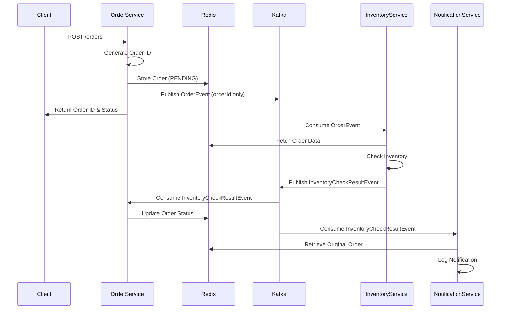
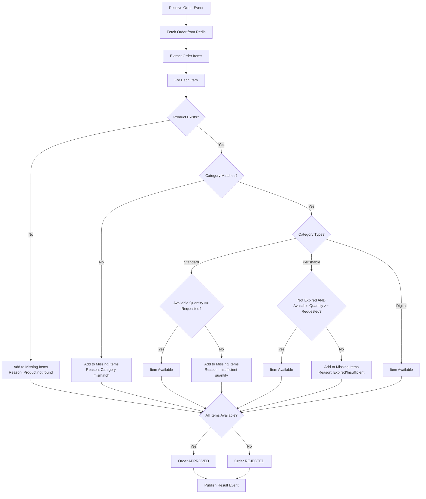

# System Architecture

## Overview

The Order Processing System is a distributed microservices architecture that demonstrates asynchronous communication, event-driven design, and domain-specific business logic. The system processes orders through a workflow involving multiple services that communicate via Kafka events and share data through Redis.

## Architecture Diagram

```
┌─────────────────────────────────────────────────────────────────────────────┐
│                              CLIENT LAYER                                   │
│  ┌─────────────────┐  ┌─────────────────┐  ┌─────────────────┐            │
│  │   Web Client    │  │  Mobile App     │  │  API Client     │            │
│  └─────────────────┘  └─────────────────┘  └─────────────────┘            │
└─────────────────────────────────────────────────────────────────────────────┘
                                    │
                                    ▼
┌─────────────────────────────────────────────────────────────────────────────┐
│                            API GATEWAY LAYER                                │
│  ┌─────────────────────────────────────────────────────────────────────┐    │
│  │                    Order Service (Port 8081)                       │    │
│  │  ┌─────────────────┐  ┌─────────────────┐  ┌─────────────────┐    │    │
│  │  │   REST API      │  │  Order Service  │  │  Kafka Producer │    │    │
│  │  │   Controller    │  │   Business      │  │                 │    │    │
│  │  │                 │  │   Logic         │  │                 │    │    │
│  │  └─────────────────┘  └─────────────────┘  └─────────────────┘    │    │
│  └─────────────────────────────────────────────────────────────────────┘    │
└─────────────────────────────────────────────────────────────────────────────┘
                                    │
                                    ▼
┌─────────────────────────────────────────────────────────────────────────────┐
│                           MESSAGING LAYER                                   │
│  ┌─────────────────────────────────────────────────────────────────────┐    │
│  │                        Apache Kafka                                  │    │
│  │  ┌─────────────────┐                    ┌─────────────────┐        │    │
│  │  │  order-events   │                    │inventory-check- │        │    │
│  │  │     topic       │                    │  results topic  │        │    │
│  │  └─────────────────┘                    └─────────────────┘        │    │
│  └─────────────────────────────────────────────────────────────────────┘    │
└─────────────────────────────────────────────────────────────────────────────┘
                    │                                    │
                    ▼                                    ▼
┌─────────────────────────────────────────────────────────────────────────────┐
│                           SERVICE LAYER                                     │
│  ┌─────────────────────────────────────────────────────────────────────┐    │
│  │                  Inventory Service (Port 8082)                     │    │
│  │  ┌─────────────────┐  ┌─────────────────┐  ┌─────────────────┐    │    │
│  │  │  Kafka Consumer │  │  Inventory      │  │  Kafka Producer │    │    │
│  │  │                 │  │  Business       │  │                 │    │    │
│  │  │                 │  │  Logic          │  │                 │    │    │
│  │  └─────────────────┘  └─────────────────┘  └─────────────────┘    │    │
│  └─────────────────────────────────────────────────────────────────────┘    │
│                                                                             │
│  ┌─────────────────────────────────────────────────────────────────────┐    │
│  │                Notification Service (Port 8083)                     │    │
│  │  ┌─────────────────┐  ┌─────────────────┐  ┌─────────────────┐    │    │
│  │  │  Kafka Consumer │  │  Notification   │  │  Logging        │    │    │
│  │  │                 │  │  Business       │  │  Service        │    │    │
│  │  │                 │  │  Logic          │  │                 │    │    │
│  │  └─────────────────┘  └─────────────────┘  └─────────────────┘    │    │
│  └─────────────────────────────────────────────────────────────────────┘    │
└─────────────────────────────────────────────────────────────────────────────┘
                                    │
                                    ▼
┌─────────────────────────────────────────────────────────────────────────────┐
│                           DATA LAYER                                        │
│  ┌─────────────────────────────────────────────────────────────────────┐    │
│  │                            Redis                                      │    │
│  │  ┌─────────────────┐  ┌─────────────────┐  ┌─────────────────┐    │    │
│  │  │  Order Cache    │  │  Session Store  │  │  Temp Data      │    │    │
│  │  │  (TTL: 10m)     │  │                 │  │  Storage        │    │    │
│  │  └─────────────────┘  └─────────────────┘  └─────────────────┘    │    │
│  └─────────────────────────────────────────────────────────────────────┘    │
└─────────────────────────────────────────────────────────────────────────────┘
```

## Request Flow

### 1. Order Creation Flow



### 2. Inventory Check Flow



## Service Responsibilities

### Order Service
- **Primary Role**: API Gateway and Order Management
- **Key Functions**:
  - REST API endpoint for order creation
  - Order ID generation
  - Redis storage management
  - Kafka event publishing
  - Order status tracking
- **Data Flow**: Receives HTTP requests → Stores in Redis → Publishes to Kafka → Updates status based on results

### Inventory Service
- **Primary Role**: Business Logic and Inventory Management
- **Key Functions**:
  - Product catalog management
  - Category-specific validation rules
  - Inventory availability checking
  - Result event publishing
- **Business Rules**:
  - Standard: Quantity-based availability
  - Perishable: Expiration date + quantity check
  - Digital: Always available

### Notification Service
- **Primary Role**: Event Processing and Logging
- **Key Functions**:
  - Inventory result processing
  - Order retrieval from Redis
  - Structured logging
  - Customer notification simulation
- **Output**: Console logs with order confirmations/rejections

## Data Models

### Order Request
```json
{
  "customerName": "string",
  "items": [
    {
      "productId": "string",
      "quantity": "integer",
      "category": "standard|perishable|digital"
    }
  ],
  "requestedAt": "ISO-8601 timestamp"
}
```

### Order (Extended)
```json
{
  "orderId": "string",
  "customerName": "string",
  "items": [...],
  "requestedAt": "timestamp",
  "status": "PENDING|APPROVED|REJECTED",
  "createdAt": "timestamp"
}
```

### Product Catalog
```json
{
  "productId": {
    "category": "string",
    "availableQuantity": "integer",
    "expirationDate": "date|null"
  }
}
```

## Technology Stack Details

### Core Technologies
- **Java 17**: Modern Java features and performance
- **Spring Boot 3.2.0**: Rapid application development
- **Spring Kafka**: Kafka integration with Spring
- **Spring Data Redis**: Redis integration with Spring

### Infrastructure
- **Apache Kafka**: Event streaming platform
- **Redis**: In-memory data store
- **Docker**: Containerization
- **Docker Compose**: Multi-container orchestration

### Communication Patterns
- **Event-Driven Architecture**: Asynchronous communication via Kafka
- **Request-Response**: Synchronous HTTP API for order creation
- **Pub-Sub**: Kafka topics for event distribution
- **CQRS-like**: Separate read/write models for orders

## Scalability Considerations

### Horizontal Scaling
- **Stateless Services**: All services can be scaled horizontally
- **Kafka Partitions**: Order events can be partitioned by order ID
- **Redis Clustering**: Redis can be clustered for high availability
- **Load Balancing**: Multiple instances can be load balanced

### Performance Optimizations
- **Connection Pooling**: Redis and Kafka connections are pooled
- **Batch Processing**: Kafka producers use batching
- **Caching**: Redis provides fast data access
- **Async Processing**: Non-blocking event processing

### Fault Tolerance
- **Retry Mechanisms**: Kafka producers have retry policies
- **Circuit Breakers**: Can be implemented for external dependencies
- **Graceful Degradation**: Services continue operating with reduced functionality
- **Data Persistence**: Redis persistence and Kafka replication

## Security Considerations

### API Security
- **Input Validation**: Comprehensive validation of order requests
- **Rate Limiting**: Can be implemented at the API gateway level
- **Authentication**: Can be added for production use
- **HTTPS**: Should be used in production

### Data Security
- **Data Encryption**: Sensitive data should be encrypted at rest
- **Network Security**: Services should communicate over secure channels
- **Access Control**: Redis and Kafka should have proper access controls

## Monitoring and Observability

### Logging
- **Structured Logging**: JSON format logs for easy parsing
- **Log Levels**: Appropriate log levels for different environments
- **Correlation IDs**: Order ID used for request tracing

### Metrics
- **Application Metrics**: Order processing rates, success/failure rates
- **Infrastructure Metrics**: CPU, memory, disk usage
- **Business Metrics**: Order volume, approval rates

### Health Checks
- **Service Health**: Each service exposes health endpoints
- **Dependency Health**: Kafka and Redis connectivity checks
- **Business Health**: Order processing pipeline health

## Deployment Architecture

### Development Environment
- **Local Docker**: All services run in Docker containers
- **Hot Reload**: Services can be restarted for code changes
- **Log Aggregation**: Centralized logging via Docker Compose

### Production Environment
- **Kubernetes**: Container orchestration for production
- **Service Mesh**: Istio for service-to-service communication
- **Monitoring Stack**: Prometheus, Grafana, ELK stack
- **CI/CD Pipeline**: Automated testing and deployment

## Future Enhancements

### Potential Improvements
- **Database Integration**: Persistent storage for orders and products
- **Payment Processing**: Integration with payment gateways
- **Email Notifications**: Real email notifications instead of logging
- **Order History**: Customer order history and tracking
- **Inventory Management**: Real-time inventory updates
- **Analytics**: Order analytics and reporting
- **Microservices**: Further service decomposition
- **Event Sourcing**: Complete event sourcing implementation

